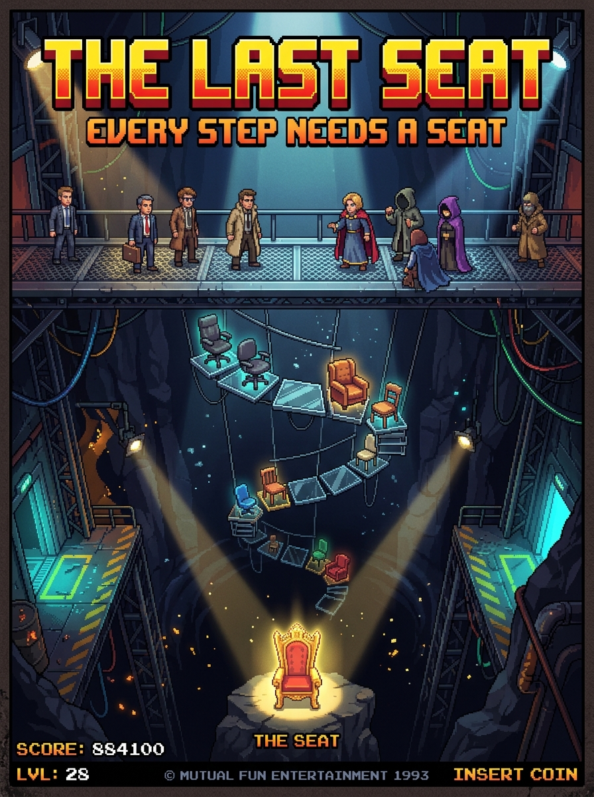

# THE LAST SEAT — Suspended Chair Bridge

> **"Every step needs a seat. Only one survives."**

[](https://opensource.org/licenses/MIT)
[](https://vercel.com/new)
[](https://vitejs.dev/)
[](https://react.dev/)
[](https://www.typescriptlang.org/)

**THE LAST SEAT** is a fast-paced, high-stakes retro pixel-art arcade trial inspired by the seat/sitter universe of Mutual Fun and the suspense of the Squid Game glass stepping stones bridge.



---

## 🎮 Game Concept & Rules

Suspended above a bottomless volumetric void abyss, a 12-tier bridge made of tempered glass pedestals and vintage chairs stretches toward the legendary **Golden Throne**.

1. **Pick Your Sitter:** Choose from 10 distinct pixel-art sitters (The Executive, The Monk, The Noir Detective, The Cyber Drifter, The Alchemist, etc.).
2. **Select Difficulty:**
   - 🟢 **EASY (2 Chairs):** 1 safe chair, 1 collapsible trap per tier (**50% odds** — authentic Squid Game glass stepping stone style). Shortkeys: `[1] [2]`.
   - 🟡 **MEDIUM (3 Chairs):** 1 safe chair, 2 collapsible traps per tier (**33.3% odds** — balanced suspense). Shortkeys: `[1] [2] [3]`.
   - 🔴 **DEADLY (4 Chairs):** 1 safe chair, 3 collapsible traps per tier (**25% odds** — the ultimate test of courage). Shortkeys: `[1] [2] [3] [4]`.
3. **Leap Forward:** Jump from chair to chair. If the chair holds, the camera glides forward to the next tier. If it shatters, glass fragments and splinters erupt as your character plunges into the abyss!
4. **Beat the Clock:** You have **75 seconds** to clear all 12 tiers.
5. **Claim the Throne:** Survive all 12 perilous tiers to sit triumphantly on the Golden Throne and share your victory stats.

---

## ✨ Features

- **Custom 2D Canvas Engine:** Crisp pixel-art rendering with custom procedural lighting, volumetric spotlights, deep abyss mist, screen shake, and multi-tier perspective depth.
- **Dynamic Camera Glide:** When a safe chair is found, the character stays on the seat while the suspension bridge and camera glide forward seamlessly.
- **100% Procedural Web Audio API:** Retro 8-bit sound effects (countdown beeps, glass shatter, bridge step chords, suspense thuds, chair collapse splinters, victory fanfares) requiring zero external audio assets.
- **Mobile & PC Friendly Layout:** Responsive scaling and touch interaction on smartphones, tablets, and desktop displays.
- **The Art Department Archive:** Browse high-res pixel art chairs and the official key promotional poster.

---

## 🛠️ Tech Stack

- **Framework:** [React 19](https://react.dev/) + [Vite](https://vitejs.dev/)
- **Language:** [TypeScript](https://www.typescriptlang.org/)
- **Rendering:** HTML5 Canvas 2D Context (procedural pixel art rasterizer)
- **Audio:** Web Audio API (procedural audio synthesizer)
- **Styling:** Modern Vanilla CSS Design Tokens (IBM Plex Mono + Playfair Display)
- **Deployment:** Vercel / Netlify / GitHub Pages ready

---

## 🚀 Getting Started

### Prerequisites

- Node.js 18+ or 20+
- npm, pnpm, or yarn

### Installation & Local Run

```bash
# Clone the repository
git clone https://github.com/your-username/the-last-seat.git

# Navigate to project folder
cd the-last-seat

# Install dependencies
npm install

# Start local development server
npm run dev
```

Visit `http://localhost:5173/` in your browser.

### Build for Production

```bash
npm run build
```

The production output will be generated inside the `dist/` directory.

---

## ☁️ Deploying to Vercel

### Option 1: Direct Git Integration (Recommended)
1. Push this repository to your GitHub account:
   ```bash
   git init
   git add .
   git commit -m "feat: initial commit of The Last Seat game"
   git branch -M main
   git remote add origin https://github.com/<YOUR_GITHUB_USERNAME>/<YOUR_REPO_NAME>.git
   git push -u origin main
   ```
2. Open [Vercel Dashboard](https://vercel.com/) and click **"Add New Project"**.
3. Import your GitHub repository.
4. Framework Preset will automatically detect **Vite**.
5. Click **"Deploy"** — your game will be live in seconds!

### Option 2: Deploy with Vercel CLI
```bash
npm i -g vercel
vercel
```

---

## ⚖️ Legal & Fan-Art Disclaimer

This game is an unofficial fan-art project created by [@alphapandaeth](https://x.com/alphapandaeth). It is not an official Mutual Fun game and is not affiliated with or endorsed by Mutual Fun. All conceptual references and character homages belong to their respective creators.

---

## 📄 License

This project is licensed under the [MIT License](LICENSE).
